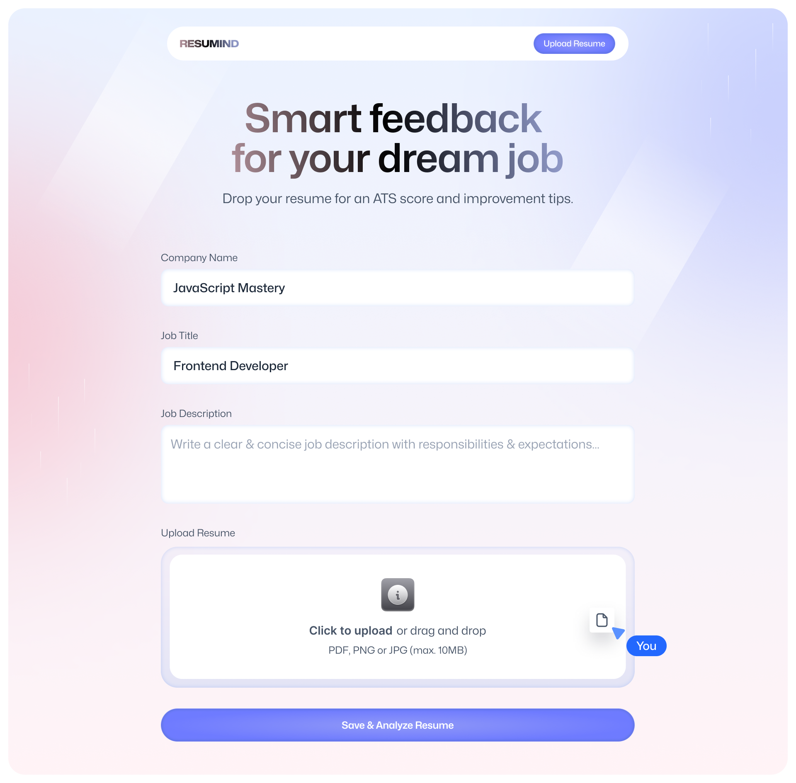
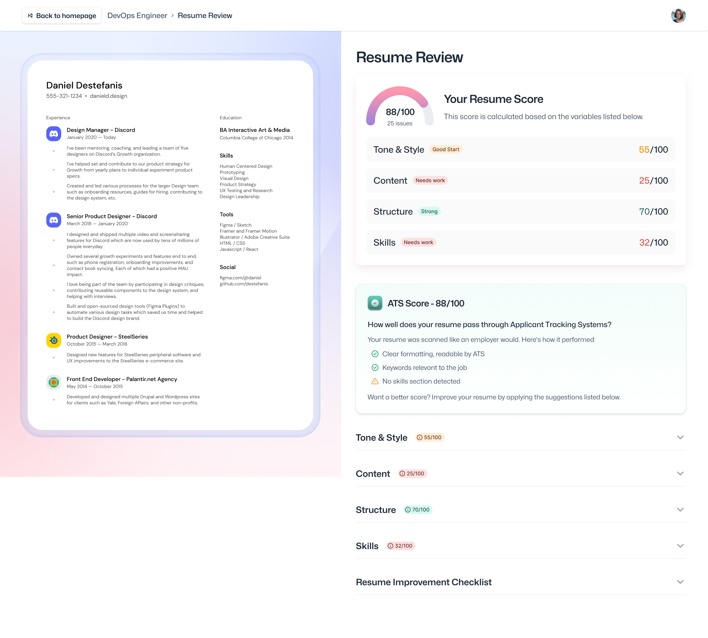

<div align="center">
  <h1>📄 AI Resume Analyzer</h1>
  <p>An intelligent tool that optimizes resumes for better performance with Applicant Tracking Systems (ATS).</p>

[](https://reactjs.org/)
[](https://www.typescriptlang.org/)
[](https://tailwindcss.com/)
[](https://vitejs.dev/)

[](https://opensource.org/licenses/MIT)
[](http://makeapullrequest.com)

</div>

## ✨ Features

- **📤 Resume Upload & Parsing**: Easily upload and parse resumes in PDF format
- **🤖 AI-Powered Analysis**: Get comprehensive AI-driven feedback on resume content, structure, and ATS compatibility
- **🎯 ATS Score & Optimization**: Receive detailed ATS compatibility scores with actionable improvement tips
- **📊 Multi-Category Analysis**: Detailed scoring across tone & style, content quality, structure, and skills assessment
- **💼 Job-Specific Feedback**: Tailor analysis based on specific job titles and descriptions
- **🔒 Secure & Private**: Built with Puter.js for secure, privacy-focused data handling
- **📱 Responsive Design**: Seamless experience across desktop and mobile devices
- **⚡ Real-time Processing**: Fast PDF-to-image conversion and instant AI analysis

## 🚀 Getting Started

### Prerequisites

- Node.js (v16 or later)
- npm or yarn
- Git

### Installation

1. **Clone the repository**

   ```bash
   git clone https://github.com/amaan-ur-raheman/ai-resume-analyzer.git
   cd ai-resume-analyzer
   ```

2. **Install dependencies**

   ```bash
   npm install
   # or
   yarn install
   ```

3. **Start the development server**

   ```bash
   npm run dev
   # or
   yarn dev
   ```

4. **Open in your browser**
   ```
   http://localhost:5173
   ```

## 🛠️ Building for Production

Create an optimized production build:

```bash
npm run build
# or
yarn build
```

## 🖼️ Screenshots

### 🏠 Homepage & Authentication

<div align="center">
  
  
</div>

### 📤 Resume Upload & Analysis

<div align="center">
  
  
</div>

### ✨ Key Features Showcase

- **Smart File Upload**: Drag-and-drop interface with PDF validation
- **Job-Specific Analysis**: Enter company name, job title, and description for tailored feedback
- **Comprehensive Scoring**: Visual score gauges for each analysis category
- **Actionable Insights**: Detailed tips for improvement with explanations
- **Resume Preview**: Side-by-side view of your resume with analysis results

## 🏗️ Project Structure

```
ai-resume-analyzer/
├── app/                    # Main application code
│   ├── components/         # Reusable UI components
│   ├── lib/                # Utility functions and services
│   ├── routes/             # Application routes and pages
│   └── root.tsx            # Root application component
├── public/                 # Static assets
│   ├── images/             # Image assets
│   └── icons/              # SVG icons
├── types/                  # TypeScript type definitions
└── vite.config.ts          # Vite configuration
```

## 🤖 AI Analysis Categories

The application provides comprehensive analysis across multiple categories:

### 📈 Overall Score

- Composite score based on all analysis categories
- Clear visual representation with score gauges
- Instant feedback on resume quality

### 🎯 ATS Compatibility

- Keyword optimization analysis
- Format compatibility checking
- Suggestions for improving ATS parsing

### 🎨 Tone & Style

- Professional language assessment
- Consistency evaluation
- Writing style recommendations

### 📝 Content Quality

- Achievement quantification
- Relevance to target role
- Content depth and clarity

### 🏗️ Structure & Format

- Layout organization
- Section arrangement
- Visual hierarchy assessment

### 💼 Skills Assessment

- Technical skills evaluation
- Skill relevance to job description
- Missing skills identification

## 🛠️ Tech Stack

- **Frontend**: React 19 with TypeScript
- **Styling**: Tailwind CSS with custom animations
- **Routing**: React Router v7
- **State Management**: Zustand
- **Build Tool**: Vite
- **PDF Processing**: PDF.js for parsing and image conversion
- **AI Integration**: Puter.js with Claude 3.5 Sonnet
- **File Storage**: Puter.js secure cloud storage
- **Authentication**: Puter.js auth system

## 🤝 Contributing

Contributions are what make the open-source community such an amazing place to learn, inspire, and create. Any contributions you make are **greatly appreciated**.

1. Fork the Project
2. Create your Feature Branch (`git checkout -b feature/AmazingFeature`)
3. Commit your Changes (`git commit -m 'Add some AmazingFeature'`)
4. Push to the Branch (`git push origin feature/AmazingFeature`)
5. Open a Pull Request

## 📄 License

Distributed under the MIT License. See `LICENSE` for more information.

## 🙏 Acknowledgments

- **[React](https://reactjs.org/)** - UI library
- **[TypeScript](https://www.typescriptlang.org/)** - Type safety
- **[Tailwind CSS](https://tailwindcss.com/)** - Styling framework
- **[Vite](https://vitejs.dev/)** - Build tool
- **[React Router](https://reactrouter.com/)** - Routing solution
- **[Zustand](https://github.com/pmndrs/zustand)** - State management
- **[Puter.js](https://puter.com/)** - Cloud platform and AI services
- **[PDF.js](https://mozilla.github.io/pdf.js/)** - PDF processing

---

<div align="center">
  <p>Built with ❤️ using React Router and powered by AI</p>
  <p>Made by developers, for developers 🚀</p>
</div>
